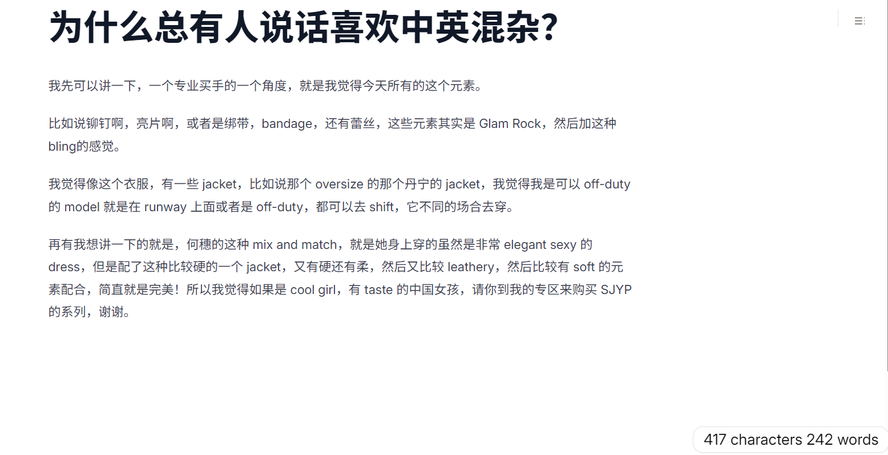

# tiptap-word-count-multilingual

## Background

When counting words, the official [Tiptap CharacterCount extension](https://tiptap.dev/docs/editor/extensions/functionality/character-count) uses a simple method: it splits the text using `text.split(' ')` and counts the resulting array's length. This approach only works for languages where words are separated by spaces.

However, this method fails to accurately count words in languages like those using [CJK characters](https://fonts.google.com/knowledge/glossary/cjk), where words are not separated by spaces.

## What this extension does

This extension addresses this issue by leveraging [Alfaaz](https://github.com/thecodrr/alfaaz). As described on its page:

> Alfaaz is the fastest multilingual word counter that can count millions of words per second (up to 0.9 GB/s 100x faster than RegExp based solutions). It has built-in support for CJK texts & words in many different languages such as Urdu & Arabic.

Compared to the original extension, this extension introduces one single change:

```ts
// Original extension
this.storage.words = options => {
    const node = options?.node || this.editor.state.doc
    const text = node.textBetween(0, node.content.size, ' ', ' ')
    const words = text.split(' ').filter(word => word !== '')

    return words.length
}

// This extension
import { countWords } from 'alfaaz'

this.storage.words = options => {
    const node = options?.node || this.editor.state.doc
    const text = node.textBetween(0, node.content.size, ' ', ' ')

    return countWords(text)
}
```

All other aspects remain identical, allowing for a seamless replacement of the original extension without significant modifications.

## Installation & Usage

### Install

```bash
npm install tiptap-word-count-multilingual
```

### Usage

```ts
import WordCount from "tiptap-word-count-multilingual";

const editor = new Editor ({
    extensions: [
        Document,
        Paragraph,
        Text,
        WordCount
    ]
})

// Get the number of words for the current document.
editor.storage.characterCount.words()

// Get the number of words for a specific node.
editor.storage.characterCount.words({ node: someCustomNode })
```

Since this extension only modifies the word counting mechanism, all settings and storage functionalities from the [official extension](https://tiptap.dev/docs/editor/extensions/functionality/character-count) should still work the same way.

If you are migrating from the official extension, simply update the import statement.

## Comparison

This works especially well in handling text that combines languages using whitespace for word breaks and languages that do not (e.g., English and Chinese).

For this passage, with the official extension, it counts **34** words:


With this extension, it counts **242** words:

